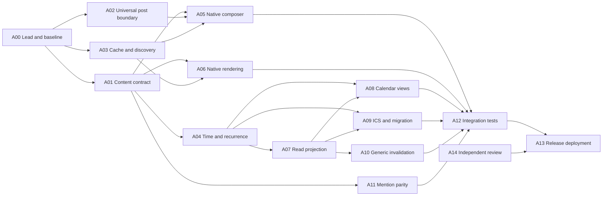

> Implementation started. See [decisions.md](decisions.md) and [task-state.md](task-state.md).

# Eventky implementation: agent assignments and coordination

This is the execution companion to [plan.md](plan.md). It assigns future implementation work; these tasks have not been implemented. The plan and its pinned contracts are authoritative when an old Eventky document conflicts with them.

## 1. How the lead keeps agents synchronized

Use one lead and at most three concurrent workers for this workspace's current four-agent capacity. The assignments below are work packages, not a request to run fourteen agents simultaneously. An agent can take a second package after its first is integrated.

The lead owns the source pins, integration branch, shared manifests/lockfiles, contract decisions, dependencies, and acceptance gates. Workers own bounded files and return evidence. Workers may message one another about a dependency, but the lead records decisions that affect more than one package.

### Shared state to create during implementation

```text
docs/eventky/
  decisions.md             # lead-owned accepted contract decisions
  task-state.md            # lead-owned status, owners, commits and dependencies
  contracts/              # versioned schemas, wire/API examples and fixtures
  handoffs/A01.md          # one report per worker/package
  handoffs/A02.md
  evidence/               # tests, screenshots, demo and recovery references
```

Each assignment must include:

```text
Task ID and objective:
Repository, base SHA and worktree:
Contract revision and required fixture paths:
Relevant decisions and prior handoffs:
Files owned; files requiring another owner's change:
Dependencies that are ready; dependencies still pending:
Deliverables and explicit acceptance tests:
Known risks/unsupported behavior:
Who must receive a breaking-contract message:
```

Workers report:

```text
Status: ready | working | blocked-on-dependency | ready-for-review | integrated
Base SHA / resulting commit or patch:
Changed files:
Behavior implemented:
Decisions made within assigned scope:
Contract changes proposed (not silently adopted):
Tests actually run and outcomes:
Outstanding limitations:
Next owner's exact inputs:
```

When a worker finds a contract mismatch, they send a short message such as:

> A03 → Lead and A02: the local post cache drops string embeds. Proposal: persist `details.embed` independently of `relationships.reposted`. This changes the cached details fixture; please confirm revision before I finalize the migration.

The lead updates the decision/fixture, notifies every affected worker, and requests an explicit acknowledgment before integrating dependent code. A worker re-reads shared state after a pause/resume or new assignment. Inherited conversation is only starting context; it does not automatically include discoveries made by siblings later.

Use distinct worktrees for edits in different packages. Avoid multiple agents editing shared barrels, route registries, `package.json`, lockfiles, database version declarations, or deployment compose files. Workers propose necessary shared changes to the lead. Do not cherry-pick an entire branch containing unrelated existing work.

## 2. Dependency map and schedule



An arrow means an input contract or completion dependency. Safe exploratory work and fixture design may begin earlier; do not merge a dependent implementation against an unagreed interface.

| Wave | Up to three worker assignments                                                     | Lead's useful parallel work                                                                       | Exit gate                                                                  |
| ---- | ---------------------------------------------------------------------------------- | ------------------------------------------------------------------------------------------------- | -------------------------------------------------------------------------- |
| W0   | A01 contract; A02 boundary spike; A12 existing-test/fixture inventory              | Pin checkouts, record VPS state, resolve task ownership and defaults                              | G0: wire/payload/membership fixtures frozen.                               |
| W1   | A02 implementation; A03 cache/discovery; A04 calendar engine spike                 | Integrate common exports/dependencies; review serialization and recurrence selection              | G1: arbitrary kinds survive the client; temporal engine chosen.            |
| W2   | A05 composer; A06 rendering; A09a single-event export                              | Run one-off vertical slice, coordinate partial-save behavior and API fixtures                     | G2: M1 demo works on unchanged PR #14, including its one-off ICS download. |
| W3   | A07 projection; A08 views/scaffold; A09 remaining feeds/import                     | Integrate temporal fixtures; UI and feeds use frozen API fixtures until the real service is ready | G3/G4: calendars and range queries are correct within stated coverage.     |
| W4   | A10 invalidation; A11 mention contract/client work; A12 integration/recovery       | Sequence A11's shared Nexus mutations after A10; verify cross-package contracts                   | Generic infrastructure and complete social parity implemented.             |
| W5   | A13 deployment preparation; A14 independent review; A12 regression/recovery reruns | Resolve confirmed findings and prepare exact release artifacts                                    | G5: ready for final release.                                               |
| W6   | A13 deployment when requested; A12 external smoke                                  | Verify deployed evidence and final state                                                          | Deployment acceptance under the user's authorized scope.                   |

M1 can ship after W2 without waiting for production outbox or a full month grid. M2 requires the additional calendar capabilities; M3/full-parity claims require A10/A11 and the associated verification. Actual duration depends on the baseline, calendar engine spike and integration results; parallelism does not remove these dependencies.

## A00 — Lead/integration owner

**Objective:** deliver the requested behavior across repositories while keeping a single coherent contract.

**Own:** decision record, task state, integration branches, shared exports/package wiring, lockfile, feature gates, final acceptance report. Preserve user changes and the ongoing VPS build.

**Work:**

1. Record PR #14 `77ae61a5` and app `31fd9a51` as initial implementation baselines; recheck upstream only at a deliberate rebase point.
2. Create isolated app and Nexus checkouts as needed. Do not start from local Nexus `main` assuming it contains this PR.
3. Freeze envelope/content, membership, temporal identity, wire adapter interfaces and occurrence API before the corresponding workers depend on them.
4. Decide initial feature flags: custom readers, event creation, calendar views, projection, import, mention extraction. Readers must remain tolerant when a writer flag is disabled.
5. Integrate one owned package at a time, run relevant checks and forward changed context.
6. Confirm each stage's evidence, including explicit limits. A successful post PUT is not enough if comments/tags/editing break.

**Done:** all requested milestone criteria have evidence and remaining future features are explicitly scoped. No premature “complete” based only on individual agent reports.

## A01 — Content contract and fixtures

**Objective:** define event/calendar JSON **inside normal post content**, with precise version and migration rules.

**Own:** proposed `packages/eventky-contract/src/{schema,validation,identity,summary}/`, schema fixtures, field mapping and contract documentation. Coordinate file split with A04/A09; they own temporal implementation and codecs, respectively.

**Read:** old `eventky-app-specs/src/models/{event,calendar,location}.rs`, current/newer specs distinctions, the main plan sections 4–7, and original RFC sources.

**Deliver:**

- Exact schemas for `eventky.event`/`eventky.calendar` version 1, temporal union, locations, revision fields, ownership-neutral organizer, membership and extensions.
- A concrete recurrence override patch allowlist, duplicate-ID rules, RDATE-period representation and supported/unsupported import policy.
- Pure parse/validate/serialize/summary interfaces. Unknown kinds/versions are distinct from invalid content; neither crashes a caller.
- Byte/work limits, deterministic source hashing, and full envelope fixtures using real generated fixture keys.
- Legacy mapping including microseconds, old URI namespaces, contributor rules and both location shapes.
- Optional generic `social` content extension reserved for A11, if adopted. Do not claim PR #14 already interprets it.

**Acceptance:** malformed JSON, arbitrary exact kinds, future versions, Unicode envelope size, unknown extension preservation, spoofed owner, incompatible timestamps and legacy examples are covered. No separate Eventky object builder or global Event/Calendar enum variant is introduced.

**Handoff:** schema and fixture revision to A02–A09 and A11. Changes after G0 require lead coordination.

## A02 — Universal post serialization and native write flow

**Objective:** make custom posts survive create/edit/repost without weakening built-in validation.

**Own existing app areas:** `src/core/controllers/post/`, `src/core/pipes/post/`, `src/core/application/post/`; explicit service input types agreed with A03. Shared global exports remain lead-owned.

**Important current symbols:** `PostController.commitCreate`, `inferPostKindForCreate`, `PostNormalizer.to`/`toEdit`/`mapKindToEnum`, `PostApplication.commitCreate`/`commitEdit`, `TCreatePostParams` and `TEditPostParams`.

**Deliver:**

1. Generic TypeScript post wire adapter with known-kind specs validation and custom-kind envelope validation. Remove fake enum casts and concrete WASM-only `.toJson()` requirements at the agreed boundary.
2. Explicit create mode/kind intent. Ordinary post inference still handles links/media; an event with a link/cover must remain `event`.
3. String embed output and legacy input adaptation; preserve parent, attachments, embed and lock through edits.
4. Author ownership checks and pure normalizers receiving already-resolved data.
5. Structured content edits; if cover/attachment editing is exposed, implement full envelope mutation with correct local rollback and file lifecycle. Existing content-only edit is insufficient.
6. Stable IDs for retries. Distinguish post PUT success from later tag failure and provide an idempotent tag repair outcome instead of duplicating the event.
7. A source-hash conflict check and documented lack of atomic conditional writes if the homeserver cannot provide them.

**Acceptance:** custom mixed-case kind survives create→cache→index→edit; long/image/short/repost fixtures retain behavior; attachments rollback correctly; existing social IDs/counts remain; unauthorized edits fail. No new homeserver Eventky path.

**Handoff:** serializable post/result interfaces and partial-save outcomes to A03/A05/A06/A12.

## A03 — Local cache, Nexus reads, filters and hydration

**Objective:** ensure custom kinds are stored and queried exactly, and all normal surfaces can retrieve them.

**Own existing app areas:** `src/core/services/local/post/`, `src/core/services/nexus/stream/posts/`, related Nexus types, post details/relationship model changes, stream kind/key types and home filter state. Database version changes are a coordinated lead-owned integration.

**Read specifically:** `src/core/services/local/post/post.ts`; `src/core/services/nexus/nexus.types.ts`; `src/core/services/nexus/stream/posts/{postStream.types,postStream.utils,postStream.api}.ts`; `src/core/models/stream/post/postStream.types.ts`; `src/core/stores/home/{home.types,home.utils}.ts`.

**Deliver:**

- Exact raw-string kinds across API parsing, Dexie, local optimistic updates, stream IDs, URL params, bootstrap/TTL and notifications.
- Canonical `details.embed` persistence independent of repost relationships, with legacy/missing values handled.
- Event/calendar filter model with no silent fallback to “all posts”; exact URI/query encoding; remove kind filtering when entering ordinary reply streams.
- Normal key/by-ID hydration for events/calendars and a stable registry hook for consumers.
- Non-destructive data migration only where fields/indexes/tables actually change. Existing kind storage already supports strings; do not add a migration merely to add an enum label.
- Backend/account namespace for derived caches; preserve durable drafts when invalidating caches.

**Acceptance:** event filter returns event only; `Event` remains distinct; refresh/restart preserves data; old embed records read; creation/deletion updates only eligible streams; pagination handles equal scores and current limits; legacy reply/collection restrictions pass.

**Handoff:** cache/stream APIs and migrations to A05/A06/A08. Coordinate filter UI ownership with A08 to avoid concurrent edits.

## A04 — Timezone, recurrence and occurrence identity

**Objective:** provide one bounded, deterministic calendar engine used by client, projection and interchange.

**Own:** proposed `packages/eventky-contract/src/time/`, `src/recurrence/`, worker interfaces and independent temporal fixtures. A01 owns schemas; A09 owns ICS serialization.

**Deliver:**

1. Compare a small set of maintained engines against the required fixtures; document supported standards, dependency/license/size and timezone behavior. Select and pin one with the lead.
2. Explicit date/UTC/zoned/floating handling, duration calculation, invalid/ambiguous time outcomes and display conversions.
3. RRULE/RDATE/EXDATE expansion, overrides keyed by original instance identity, moved/cancelled occurrences and bounded window queries.
4. Handle old series, long overlaps, zero-duration events and moved-in exceptions during candidate selection.
5. Stable engine/tzdb versioning in cache keys, CPU/count/time budgets, browser-worker cancellation and explicit incomplete results.
6. A documented supported recurrence profile. Unsupported imports stay preserved/read-only where possible; no silent approximation.

**Acceptance:** independently specified Zurich DST, fractional-offset zone, monthly/annual edge cases, exclusive date ends, exclusions, periods, overrides and range bounds; browser/service fixture output matches. No unbounded expansion or host-timezone-dependent calculations.

**Handoff:** `expandOccurrences`, identity, validation and display interfaces to A05/A06/A07/A08/A09.

## A05 — Event and calendar creation/editing

**Objective:** make event creation feel like native post creation.

**Own:** `PostInputActionBar/`, `PostInput/`, `DialogNewPost/`, `DialogEditPost/`, relevant `usePost`, `usePostInput`, draft/confirmable-dialog state; proposed event/calendar form molecules/organisms. Coordinate shared input ownership before starting.

**Deliver:** Event beside Article, typed modes, event/calendar forms, retained drafts, complete dirty-state detection, recurrence preset/preview controls using A04, native Markdown/media/tag controls, authorized calendar picker and contributor management UI.

**Important behavior:** title/start validate independently of ordinary post text; empty description is allowed; keyboard submit does not fire from date popovers; duplicate submit is prevented; failed save retains all fields; tag-only failure offers repair. Switching modes preserves relevant content. All structural editing uses A02's full post contract.

**Acceptance:** desktop/mobile creation and edit; cancel/discard date-only changes; cover replacement and rollback; recurrence field validation; unauthorized calendar membership; post kind remains event when media/links are added; ordinary text/article composition unchanged.

**Handoff:** interaction stories, field errors and create/edit test hooks to A12; renderer fixtures to A06.

## A06 — Native post rendering and social parity

**Objective:** specialize the body while reusing native post behavior everywhere.

**Own:** `PostContentBase/`, proposed Event/Calendar content components and safe fallback, semantic preview consumers in post page metadata, `NotificationItem`, copy-text utilities and embedded/visual feed views. Shared `PostMain`/`SinglePostCard` changes should be minimal and coordinated.

**Read:** `PostMain`, `PostActionsBar`, `SinglePostCard`, `SinglePostContent`, `ThreadTree`, `usePostMenuActions`, `useVisualFeedTiles`, `app/post/[userId]/[postId]/page.tsx`.

**Deliver:** compact/detail/repost renderers, date/time/status/cover/location/description metadata, occurrence selector, calendar navigation, native actions and counts, semantic OG/copy/notification summaries, safe invalid/unsupported/tombstone states. Preserve authentication and existing viewer moderation/guest rules.

**Acceptance:** same event URI supports native tags/replies/repost/bookmark/edit/report/mute in feed and detail; no duplicate social footer; no raw JSON in copy/OG/notifications; no automatic link scraping inside raw JSON; deleted or moderated bodies do not leak via specialized views; cover/no-cover visual feeds work.

**Handoff:** registry/render contracts and story fixtures to A08/A09/A12.

## A07 — Rebuildable calendar projection and occurrence API

**Objective:** answer calendar/time queries without creating new authoritative event resources.

**Own:** proposed `services/eventky-projection/` storage, sync adapter, read API and tests. Exclude A09 feed serialization and A10 Nexus mutation implementation; agree subdirectories/interfaces first.

**Deliver:**

1. SQLite migrations for source rows, claimed/effective memberships, occurrence caches, durable invalidation jobs, checkpoints and generations.
2. Existing `/v0/events` consumer plus **complete current-state reconciliation**. A bounded API-only demo and a robust full inventory must not be conflated. Choose a streamed local graph inventory or A10's generic inventory before claiming scalable coverage.
3. Current-state hydration for both PUT and DEL; idempotency, per-URI ordering, failed-scan protection, retries and explicit unavailable/invalid distinction.
4. Membership derived from URI author and calendar policy; revoke/exclude/delete recalculation; no cross-account writes.
5. Bounded overlap query and stable opaque cursor bound to filters/revision; shared A04 recurrence; all-day/floating/long/moved-instance handling.
6. Status with source identity, checkpoint, reconciliation time, pending work, parse failures, coverage and lag. Reset/rebuild detection and repair runbook.
7. No duplicated tag/bookmark/comment stores. Return source post IDs for normal viewer-aware hydration.

**Acceptance:** restart and replay; invalid source; moderator tag deletion; changed kind; recreated post after delayed DEL; revoked calendar contributor; failed inventory does not delete unseen rows; old recurring series queried in the future; queries never silently truncate.

**Handoff:** executable API fixtures and readiness behavior to A08/A09/A12/A13. Initial adapter is explicitly eventually reconciled; A10 supplies stronger semantics later.

## A08 — Native agenda/calendar navigation and local preferences

**Objective:** make event discovery and calendars usable inside the Pubky App shell.

**Own:** proposed Events/Calendars routes/templates, agenda/month/week/day components, calendar query hooks/controllers/read applications/services, local preference store. A03 owns generic stream/storage types; A06 owns post content rendering.

**Deliver:** agenda first; date navigation/timezone/week start; calendar overlays; native discovery filters; My events/My calendars distinctions; canonical post navigation; account/backend-scoped selected calendars and reminder preferences; query/cache invalidation tied to source/engine versions.

**Contract:** M1 fixture preview is explicitly bounded. M2 uses A07 for event-time order/ranges and normal post hydration for social state. Apply effective viewer filters before claiming a complete page; never present an incomplete empty schedule as authoritative.

**Acceptance:** responsive agenda/month/week/day; keyboard/screen reader navigation; all-day lane and overlap display; source edit/delete/cancel reflected; subscription distinct from bookmark; calendar membership denial; stale/partial/unsupported states; back navigation and scroll preserved.

**Handoff:** browser routes, component stories and query acceptance scenarios to A12.

## A09 — iCalendar export/import and legacy migration

**Objective:** make external calendars and old Eventky data work through the new post model.

**Own:** proposed `packages/eventky-contract/src/ical/`, migration helpers, client import/export UI, and projection ICS route handler subdirectory. Coordinate A06 export actions and A07 server interfaces.

**Implement in two bounded passes:**

- **A09a:** one-off event download before M1; then recurring-event export, calendar subscription feed, override and VTIMEZONE support, HTTP validators and explicit coverage/errors after A04/A07 are ready.
- **A09b:** bounded file parser, import preview/grouping/duplicate ledger, ownership/provenance checks, legacy URI mapping and resumable dry-run migration.

**Deliver:** semantic RFC mapping, UTF-8 folding/escaping, supported extension preservation and unsupported-feature reporting; safe HTML conversion; private-field/attendee/alarm preview; no iTIP mail automation. Local alarms need explicit user opt-in and are not guaranteed closed-browser notifications. Delegate push delivery only as a separately defined future package.

**Acceptance:** round trips with independent fixtures and selected external calendar applications; all-day/DST/recurring/moved/cancelled cases; duplicate imports do not duplicate posts; unknown organizers cannot update another user's event; legacy calendars publish first and references remap; no legacy resource deletion or invented attribution.

**Handoff:** interoperability matrix, import ledger schema, export completeness behavior and migration evidence to A12/A13.

## A10 — Generic post invalidation and inventory hardening

**Objective:** give projections a reliable post-change/inventory contract without embedding Eventky schemas in Nexus.

**Own Nexus branch:** generic Post mutation/outbox/inventory modules and routes plus related integration tests, based on PR #14. Coordinate shared post mutation files with A11; do not merge these concurrently without rebasing.

**First deliver a design spike:** enumerate every actual mutation path, graph/cache transaction boundary, hard delete, tombstone, moderation, retry, reset and maintenance path. Choose transactional outbox and inventory semantics that can actually be implemented in this architecture. Explain how cursor ordering is established; wall-clock time alone is insufficient.

**Then implement:** mutation invalidations with epoch/revision, durable deletion records, retryable delivery, cursor expiry/reset errors, stable paged inventory/watermark and consumer recovery tests. Include revision-consistent hydration or a cache-readiness barrier so a committed graph change is not consumed through stale Redis details. Update A07 behind its sync interface.

**Acceptance:** a crash at graph commit/cache update/outbox delivery does not permanently hide a mutation; moderator-derived deletion and kind changes are observable; rebuild/expired cursor triggers inventory; duplicates are safe; source revisions and cached hydration consistency are documented. No `event`/`calendar` parser, new Event node or Eventky object paths in Nexus.

**Handoff:** protocol fixtures and failure-injection evidence to A07/A12/A13. This is additional work beyond PR #14; M1 does not depend on it.

## A11 — Generic mention extraction and full social parity

**Objective:** close PR #14's custom-content mention gap without inventing Eventky notification storage.

**Own:** a small independently reviewed generic custom-post social-text contract and Nexus extraction integration; client contract/serializer change coordinated with A01/A02. Sequence edits to shared mutation code after or rebased on A10.

**Recommended design to evaluate:** an explicitly opted-in, versioned `social` section **inside** custom content, for example `{version: 1, text: "human-authored mention-bearing text"}`. Eventky's serializer generates that text from supported human description fields. The indexer recognizes this generic convention, applies bounded parsing and the existing mention parser, and otherwise keeps opaque custom content behavior. A01 must freeze the actual extension before writing it; this is not current PR behavior or an established Pubky standard.

Do not scan every JSON string for keys/URIs, infer mentions from calendar membership or organizer fields, or let a sidecar forge native notifications. Known built-in extraction must retain its current behavior. Custom-kind edits must reconcile removed mentions correctly.

**Acceptance:** actual description mention produces existing mention relation/notification; no mention from calendar/location/attachment/organizer references; removed mention clears; malformed/future extension safely falls back; duplicate replay does not create duplicate semantic notifications. Client rendering and native notification preview agree.

**Handoff:** exact optional extension, backward-compatibility behavior and tests to A01/A02/A06/A12. If this design is rejected or deferred, the lead must leave description mention parity explicitly incomplete rather than declaring all post functionality done.

## A12 — Integration, regression and recovery verification

**Objective:** independently prove the complete user flow and expose false assumptions between packages.

**Own:** cross-package fixtures, app Cypress integration suites, projection recovery harness, demo script and evidence manifests. Unit/component tests normally stay with their implementation owner.

Start during W0 by mapping existing tests and preparing a canonical fixture matrix. Later test real homeserver writes → watcher → Nexus graph/cache/API → browser, with dedicated fixtures, as well as service-free contract tests.

**Required journeys:** one-off native social lifecycle; calendar owner/contributor lifecycle; recurring DST and moved occurrence; import/export; malformed/unknown/tombstone; post success/tag failure repair; optimistic rollback; deployment backend switch/cache isolation; projection reset/moderation/reconciliation; text/article/media regressions.

Use existing `npm run lint`, typecheck, Vitest/build and Cypress desktop/mobile scripts appropriately. Run Nexus focused integration/library tests and broader required checks for changed modules. Do not mark a test passed because it was listed in the PR description.

**Done:** evidence points to actual commits, commands, outputs and screenshots; failures are reproduced and routed to owners; unsupported behavior appears in the release notes. Every promised social action is exercised through the same UI used by ordinary posts.

## A13 — VPS deployment and operations

**Objective:** deploy the verified fork beside the existing Nexus work when deployment is requested, with a recoverable configuration.

**Own:** an explicit deployment branch/artifact pack, frontend/projection container definitions, reverse proxy/TLS changes, measured resource plan, backups and rollback runbook. The current planning task does not deploy these artifacts.

**Read first:** `/opt/pubky-vibe/deploy/README.md` and current service state. Source checkout is already correct; build may still be active. Preserve persistent identity, config, current mainnet network, private DB ports, volume names and guard behavior.

**Prepare:** exact image/source pins; domain parameters; TLS proxy routing; explicit build-time frontend endpoints; relevant CORS/service worker/cache checks; frontend/projection service health; observed memory/disk budgets; backup/restore commands; independent rollback; projection rebuild/reset procedure.

**Acceptance:** browser login/read/write/media against correct mainnet stack; HTTPS endpoints; no staging fallback or mixed content; databases private; source/index discovery caught up enough for fixtures; health and projection-lag checks; restart persistence and rollback tested; existing Nexus deployment evidence retained.

No broad infrastructure replacement, new homeserver, registry listing, real-account fixture publication, or destructive volume operation is implied by this package. Prepare the concrete release first; perform public actions under the user's implementation/deployment authorization.

## A14 — Fresh-context final review

**Objective:** challenge the integrated result without relying on the implementers' shared assumptions.

**Read:** requirements, frozen contracts, code diff, source pins and test evidence. Begin without the implementers' exploratory conversations; obtain factual handoffs as needed.

**Review:** lossless kind/embed editing; native UI reuse; calendar author authority; event-time query coverage; recurrence identities/DST; importer/exporter fidelity; malicious/unsupported payload behavior; projections and moderation; source/reset/rollback semantics; unintended old object paths and hidden duplicate social systems.

For each suspected issue, reproduce or trace the real path before reporting. Return file/line evidence, trigger, actual impact and a concrete verification. Do not invent a mandatory model-specific security audit; none was requested for this plan.

**Done:** lead resolves confirmed findings, reruns affected checks and records remaining limitations. Review completion is not permission to publish comments or deploy independently.

## 3. Copyable kickoff instruction

> Implement M1 of `docs/eventky-native-plan.md` using the assignments in `docs/eventky-agent-briefs.md`. Act as lead and delegate independent packages to at most three concurrent workers. Start from the pinned Nexus PR and Pubky App baselines, preserve existing work, and freeze wire/content fixtures before dependent edits. Give every worker its files, contract revision, dependencies and acceptance tests. Relay contract changes to affected workers and maintain shared decisions/task state. Deliver a working native Event action beside Article, event/calendar posts on normal post paths, and the existing comments/tags/repost/bookmark/edit/delete flows against unchanged Nexus PR #14. Verify the complete vertical slice and report exact evidence. Keep later recurrence/projection/parity milestones explicitly tracked.

The lead can then start M2/M3 packages from their recorded contracts without reconstructing context from separate chat histories.
