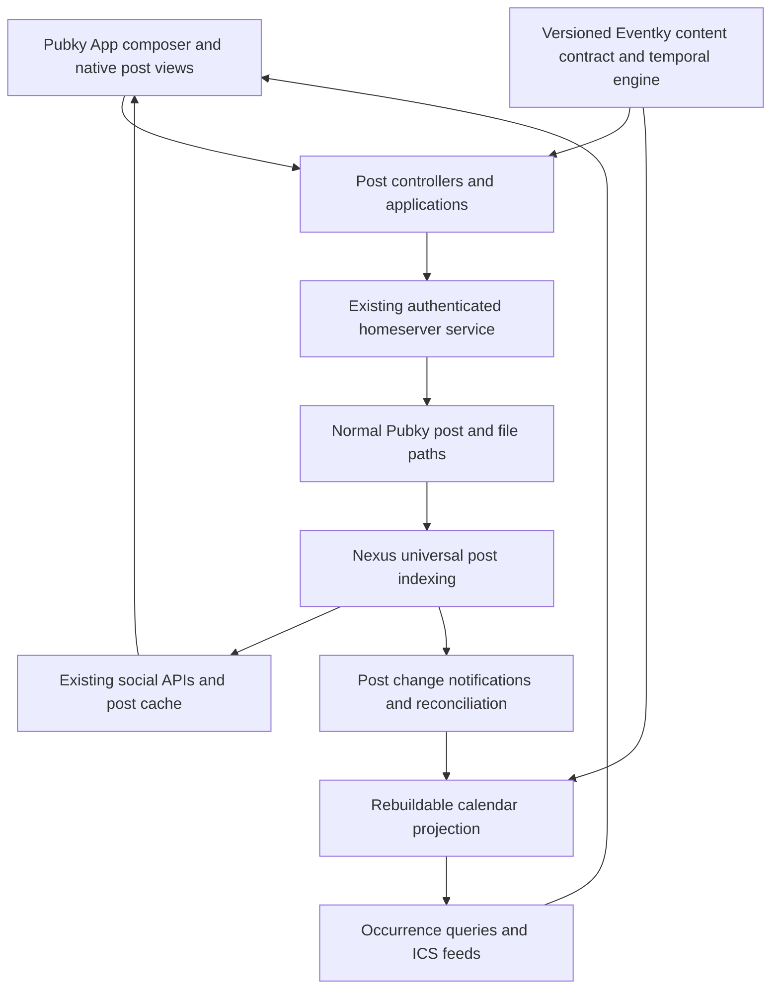

> Implementation started on current upstream dev. See [decisions.md](decisions.md) for updated baselines and [task-state.md](task-state.md) for progress.

# Eventky inside Pubky App: implementation plan

Status: implementation proposal, based on code and a read-only VPS inspection on 2026-09-08. No application, schema, or VPS changes were made while preparing this plan.

The recommended outcome is an Eventky-enabled fork of **Pubky App**, where an event is an ordinary `PubkyAppPost` with `kind: "event"`, and a calendar is an ordinary post with `kind: "calendar"`. Their content contains versioned calendar data. Existing post identities, feeds, replies, tags, reposts, bookmarks, author controls, and moderation remain the social foundation.

The first milestone must demonstrate that these work on **unchanged Nexus PR #14**, without registering an Eventky namespace or adding event/calendar variants to Nexus. Rich date queries subsequently come from a rebuildable calendar projection. That projection owns no authoritative event objects and accepts no event writes.

Detailed, independently assignable agent tasks are in [agent-briefs.md](agent-briefs.md).

## 1. Verified starting point

| Area                    | Inspected baseline                                                                                                                   | Consequence                                                                                                                      |
| ----------------------- | ------------------------------------------------------------------------------------------------------------------------------------ | -------------------------------------------------------------------------------------------------------------------------------- |
| Nexus PR                | [gillohner/pubky-nexus #14](https://github.com/gillohner/pubky-nexus/pull/14), open; head `77ae61a524d3c19c71f674e45874de1c08a91527` | Pin this commit for the demonstration and compatibility fixtures.                                                                |
| PR base                 | `954ea73034fa3147fbea787b06eee7ec00543ce4`, branch `poc-base/upstream-main-954ea73`                                                  | The PR is based on an upstream snapshot, not the fork's divergent `main`.                                                        |
| Local Nexus workspace   | `main`, `9794f1c5`; existing untracked `config-local/`                                                                               | Do implementation in an isolated checkout from PR #14. Preserve the existing local config.                                       |
| VPS Nexus checkout      | `/opt/pubky-vibe/pubky-nexus`, exactly `77ae61a5`; clean when inspected                                                              | The intended PR is already checked out remotely.                                                                                 |
| Pubky App               | `/home/gil/Repositories/pubky/pubky-app`, clean `master`, `31fd9a51c1ad6a666e7e0616b9f5a7ed6088aa94`                                 | Next.js 16, React 19, Dexie, Zustand, Shadcn, Vitest and Cypress. Its installed specs dependency is `pubky-app-specs` **0.4.4**. |
| Legacy Eventky specs    | `897a28e9baffde3968ab4a210294ffa9aa10522b`                                                                                           | `src/models/location.rs` has an existing uncommitted modification; preserve it and distinguish its shape from committed data.    |
| Legacy Eventky UI       | `6ef2fa33da809214dacb0618883ddeba1f52e4ee`                                                                                           | Useful field, recurrence, and migration references; its application shell and bespoke social flows are not the destination UI.   |
| Local newer Pubky specs | `686f3d26cf5a948c7160bcf92eaa9f65e2ec3718`                                                                                           | This is not the app's installed 0.4.4 package. Its `Unknown` enum still does not preserve arbitrary kind strings for authoring.  |

The [PR contract](https://github.com/gillohner/pubky-nexus/blob/77ae61a524d3c19c71f674e45874de1c08a91527/docs/custom-post-kinds.md) establishes:

- Posts remain at `/pub/pubky.app/posts/{id}`; `content` remains a **string**.
- Custom `kind` values are exact and case sensitive. The whole custom-post JSON document is limited to 512 KiB; kind strings have their own 1–128 UTF-8 byte constraint.
- API output changes to `embed: string | null`. Legacy embed objects are accepted as input.
- Unfiltered social feeds include custom posts. Existing post streams and content search accept exact custom kind filters; batch hydration preserves custom kinds without a kind-filter parameter.
- `parent` is a reply relation. Embedding a Pubky post creates repost semantics. Neither is calendar membership.
- Custom content stays opaque and does not create mention edges. Search is over raw content text.
- There is no temporal query, recurrence engine, reverse calendar membership query, or Eventky plugin framework in this PR snapshot.

### VPS facts and deployment boundary

The deployment files are in `/opt/pubky-vibe/deploy`; persistent config and evidence are in `/srv/pubky-vibe`. The pinned orchestration checkout is `75b1121f3e90b9b44d9416ca4f5ba87a4984e800`.

At inspection, a Rust/Docker build was running, no containers were listed, and only SSH was publicly listening. This is a point-in-time observation, not a failed-deployment diagnosis. Do not launch competing builds or alter the ongoing deployment.

The existing README describes a **mainnet, Nexus-only deployment**: Nexus, Neo4j, Redis; no frontend, homeserver, Homegate, or PostgreSQL. Its planned API is `http://159.69.22.174`, with nginx on port 80 after its own verification stages. A browser client needs an HTTPS deployment before using this publicly; an HTTPS page cannot depend on that HTTP API directly.

Planning default: retain this Nexus and use existing mainnet homeservers with dedicated demo identities. A domain is a deployment parameter. A separate testnet is useful for automated fixtures and is not a replacement for the user's current instance.

## 2. Product contract

### Required experience

1. In the existing post composer, place **Event** beside **Article**, using the same action-button component, sizing, icon treatment, tooltips, focus behavior, and mobile conventions.
2. Selecting Event opens event fields in the native creation flow. Publication creates a normal post, not an Eventky resource elsewhere.
3. Events appear in Home, Following, profiles, bookmarks, tag results, search, reposts, and canonical post pages wherever equivalent posts are supported.
4. The post body displays a useful event card: title, date or range, timezone, location, recurrence, status, cover, and description preview.
5. The surrounding author header, post menu, comments, tags, counters, repost dialog, bookmark action, reporting, and moderation use existing Pubky components and controllers.
6. The canonical address stays `/post/{author}/{postId}`. An occurrence selection may add a query parameter; it does not create a new post identity.
7. Calendars are discoverable posts with a native calendar body, owner and contributor metadata, and an action opening their event view. Creating one uses the same post workflow, reached from the Events/Calendars area and an appropriate composer menu.
8. Add an Events area with agenda first, followed by month/week/day views, filters, timezone selection, and calendar overlays. A calendar grid is an additional view of posts.

### Native behavior matrix

| Existing behavior      | Event/calendar behavior and acceptance requirement                                                                                                                                                                                                      |
| ---------------------- | ------------------------------------------------------------------------------------------------------------------------------------------------------------------------------------------------------------------------------------------------------- |
| Replies and threads    | Ordinary reply posts with `parent` equal to the event/calendar post URI. Existing editor, counts, threading, pagination, and notifications.                                                                                                             |
| Tags                   | Ordinary Pubky tags targeting the same post URI, with the existing picker, chips, suggestions, taggers, and removal rules. No `/pub/eventky.app/tags` writes.                                                                                           |
| Reposts and quotes     | Existing repost mechanism references the event/calendar URI. A renderer resolves the referenced post's actual kind; no embed-kind field is required.                                                                                                    |
| Bookmarks              | Existing bookmark object and button. Bookmarking does not mean attending or subscribing.                                                                                                                                                                |
| Author/profile         | Existing avatar, identity, follow, profile posts, and user relationship behavior. Organizer text does not override the authenticated post author.                                                                                                       |
| Edit                   | Author-only native action opens the correct event/calendar editor; preserves URI, kind, attachments, reply/embed values, UID, and unknown supported extension data.                                                                                     |
| Delete                 | Existing deletion semantics apply. A post may become a `[DELETED]` tombstone. Detect this before event JSON parsing; clear calendar projections.                                                                                                        |
| Report/mute/moderation | Preserve existing viewer policy, censored states, and report flows in every personalized view, including calendar grids. Public subscription feeds apply a documented public moderation policy; they cannot know an anonymous subscriber's local mutes. |
| Share/copy             | Canonical post link; copy event text through a semantic serializer, never raw JSON. Add `.ics` as a separate action.                                                                                                                                    |
| Notifications          | Existing reply/tag/repost notifications must display event/calendar previews correctly. Event-description mentions need additional work; see below.                                                                                                     |
| Media                  | Use Pubky's file upload, attachment, image, and fallback behavior. Store cover choice in content referencing an ordinary attachment.                                                                                                                    |
| Search                 | Exact kind filters initially use Nexus. Rich date/location/calendar search uses the projection later. Human-facing snippets omit JSON syntax.                                                                                                           |
| Offline/error handling | Keep existing optimistic writes and rollback. Preserve drafts and retry affordances; do not claim a durable offline outbox exists today.                                                                                                                |

**Mention parity is a specific gap.** PR #14 intentionally skips mention extraction from custom content. Mentions in ordinary comments work. Full mention notifications from event descriptions require a separately specified, generic opt-in social-text extraction contract, or an explicit later scope decision. Task A11 defines this without adding an event-specific switch to Nexus. A release claiming complete post parity must pass that task's acceptance tests.

### Product scope by delivery stage

| Stage                                   | Included functionality                                                                                                                                                                                                                                                                                                         |
| --------------------------------------- | ------------------------------------------------------------------------------------------------------------------------------------------------------------------------------------------------------------------------------------------------------------------------------------------------------------------------------ |
| M1: native universal-kind demonstration | Event/calendar create, edit, delete; one-off timed and all-day events; title, descriptions, status, cover, physical/online links; calendar references; native social wrappers; safe unsupported-kind handling; single-event ICS export; a small, explicitly bounded seeded calendar/agenda. Recurrence authoring waits for G3. |
| M2: usable calendars                    | Shared recurrence engine, series exceptions, authorized membership, complete bounded-range queries over indexed data, agendas and month/week/day views, calendar overlays, local calendar subscriptions, import preview, feed exports, local reminder preferences.                                                             |
| M3: parity and operational hardening    | Generic mention parity, reliable projection invalidation/reconciliation, recovery tests, interoperability matrix, large-calendar performance, accessibility/mobile polish, production-quality subscription feeds.                                                                                                              |
| Further work                            | “This and following” edits, richer venue/speaker/schedule data, calendar curation modes, portable private preferences, reminder push service, optional RSVP protocol.                                                                                                                                                          |

RSVP/attendance is not a prerequisite for the requested event/calendar demonstration. It must never be inferred from a bookmark, reply, tag, or calendar subscription. If added later, define it separately using the universal post approach rather than restoring the old attendee namespace. Actual private calendars, CalDAV synchronization, ticketing, and cross-account event editing require separate protocols and are outside the first release.

## 3. Architecture and ownership



Recommended implementation locations, to be created during implementation:

- A small pure TypeScript workspace package in the Pubky App fork, `packages/eventky-contract/`, containing payload types, validation, compatibility readers, semantic text, recurrence interfaces, and fixtures. Its schema describes **post content**, not a homeserver object namespace.
- Event/calendar UI and local application integration within existing `pubky-app/src/` layers.
- An optional `services/eventky-projection/` workspace service sharing the contract/temporal package. It derives calendar membership and occurrences, initially with SQLite and explicit migrations. It has no login session, signing key, or event mutation endpoint.
- Nexus remains at the PR baseline for M1. Any generic invalidation or mention extension is its own small branch/PR on that baseline, independent of event rendering and schema details.
- Legacy `eventky-app-specs` supplies migration fixtures and field mapping. Do not import its old Event/Calendar builders into the new publication path.

The same pure temporal implementation should run in the browser worker and projection service. Select and pin an existing RFC-capable implementation after a fixture spike; avoid a hand-written RRULE engine. Evaluate timezone support, VTIMEZONE handling, recurrence overrides, browser size, licensing, and bounded expansion. Package selection is an implementation task, not an unsupported claim that the current app already has these capabilities.

### Respect the Pubky App architecture

The repository's [AGENTS.md](../../AGENTS.md) and [architecture document](../../docs/architecture.md) require UI/coordinators → controllers → application → services → models, with pure pipes and store mutation in controllers. Keep event/calendar publication within `PostApplication`; do not invent a parallel Eventky social application.

New query controllers can orchestrate calendar-read applications/services. Do not introduce application-to-application calls that violate the existing allowlist. Resolve records before passing them into normalization; existing DB reads inside `PostNormalizer` are not a pattern to extend.

## 4. Universal post boundary

### Envelope

The homeserver JSON is still a post. Construct it as follows; the expression makes clear that `content` is serialized once into a string:

```ts
const post = {
  kind: 'event', // or exactly "calendar"
  content: JSON.stringify(payload),
  parent: null, // ordinary replies set this separately
  embed: null, // calendar membership is not an embed
  attachments: attachmentUris,
};
```

Use existing post ID generation and Pubky URI builders. A local post ID is `author:postId`, while wire references use the full Pubky URI. Do not introduce a second event ID as the social identity. `uid` is a calendar interchange identity.

Implement a generic wire adapter instead of teaching the installed numeric WASM enum about Event and Calendar:

1. Known built-in kinds retain their existing specs validation and sanitization.
2. Custom kinds pass the PR's generic envelope rules and a registered client content validator when available.
3. Normalize legacy `{uri, kind}` embeds to their URI at the read boundary; store the exact current URI independently of derived repost relationships.
4. Serialize the final post as plain wire JSON through the existing homeserver service. Refactor `PostResult`/`.toJson()` assumptions at a single boundary instead of forcing a fake WASM instance.
5. Preserve exact unknown kind strings end to end. Normalize only explicitly recognized legacy built-in enum outputs, not every string with `toLowerCase()`.
6. Validate actual UTF-8 byte length of `JSON.stringify(post)`, including escaping in `content`. The 512 KiB limit is not just a description limit.
7. Preserve supported envelope fields, including `lock` where present. Unknown arbitrary top-level fields are not guaranteed to survive Nexus; put extension data inside content.

Event/calendar validation is optional from Nexus's perspective and mandatory for the publishing client. Invalid custom content may still exist on the network. Readers must be total: one invalid post cannot crash a stream, SSR page, calendar, notification, or export.

### Content registry

Define a small local registry keyed by exact kind. Each supported entry provides:

- `parseContent` with explicit supported, unsupported-version, and invalid results;
- `summarize`, `getPlainText`, and cover/preview extraction;
- feed, detail, embedded-post, and edit renderers;
- validation and serialization;
- optional occurrence or calendar read capability.

Add Event and Calendar entries alongside the existing built-in handlers. An unknown kind renders a normal post shell with a concise unsupported-format body and safe generic actions. A malformed known kind renders an unavailable-content state; a future schema version is not silently edited as version 1. Preserve the raw string in storage. No server-controlled plugin download or remote schema execution.

## 5. Proposed version-1 event content

This is an **Eventky content profile**, with RFC-oriented field names and explicit JSON types. It is not claimed to be the RFC 8984 JSCalendar wire format or an iCalendar document. RFC 5545 governs interchange semantics; RFC 7986 supplies additional metadata. A future JSCalendar adapter can translate the profile without changing post identities.

### Temporal types

```ts
type CalendarTime =
  | { type: 'date'; value: string } // YYYY-MM-DD
  | { type: 'utc'; value: string } // YYYY-MM-DDTHH:mm:ssZ
  | { type: 'zoned'; value: string; tzid: string } // wall time + supported TZID
  | { type: 'floating'; value: string }; // wall time, intentionally no zone
```

The writer defaults to zoned time, seeded from the selected calendar or device setting. An all-day switch creates a date value. Floating time is an advanced/import feature and is labeled explicitly. Never infer all-day from midnight, and never replace a zoned recurring wall time with a stored UTC offset.

Newly authored TZIDs use the selected engine's IANA database, with UTC represented explicitly. M2 imports may additionally supply `timezone_definitions`, a map from a TZID to a parsed-and-validated VTIMEZONE component string. Proposed cap: 16 definitions and 64 KiB combined, still subject to the whole-post cap. Reject duplicate/conflicting definitions; resolve a referenced custom TZID only through its validated definition. Preserve an unsupported definition inertly and keep that event's scheduling/editor functions unavailable until the engine supports it. Merely saving a string in `extensions` does not make its timezone executable.

### Example event payload

```json
{
  "schema": "eventky.event",
  "schema_version": 1,
  "uid": "urn:uuid:54166551-4ec7-4cab-a4b8-91c749d1fd21",
  "dtstamp": "2026-09-08T09:00:00Z",
  "created": "2026-09-08T09:00:00Z",
  "last_modified": "2026-09-08T09:00:00Z",
  "sequence": 0,
  "summary": "Pubky community meetup",
  "description": "Meet the community and try native events in Pubky.",
  "styled_description": {
    "format": "markdown",
    "content": "Meet the community and try **native events** in Pubky."
  },
  "dtstart": { "type": "zoned", "value": "2026-10-01T18:30:00", "tzid": "Europe/Zurich" },
  "duration": "PT2H",
  "status": "CONFIRMED",
  "transp": "OPAQUE",
  "calendar_uris": [],
  "locations": [
    { "id": "venue", "kind": "PHYSICAL", "label": "Community space, Zurich" },
    { "id": "call", "kind": "VIRTUAL", "label": "Join online", "uri": "https://example.org/meetup" }
  ],
  "rrule": "FREQ=WEEKLY;BYDAY=TH;COUNT=6",
  "rdate": [],
  "exdate": [],
  "overrides": [],
  "categories": [],
  "extensions": {}
}
```

`calendar_uris` and media URIs are filled with valid post/file references after allocating or selecting them; the example deliberately does not invent valid Pubky public keys. This object goes inside `content`, never directly at an Eventky path.

### Field contract and legacy mapping

| Field                                 | Proposed rule                                                                                              | Legacy mapping / purpose                                                                                                         |
| ------------------------------------- | ---------------------------------------------------------------------------------------------------------- | -------------------------------------------------------------------------------------------------------------------------------- |
| `schema`, `schema_version`            | Required literal and integer; exact dispatch; retain unknown extensions                                    | New content-version boundary, independent of Pubky v0 paths.                                                                     |
| `uid`                                 | Required nonempty immutable interchange identifier; generated once                                         | Preserve existing event UID on migration. Different authors may publish the same imported UID; do not deduplicate them globally. |
| `summary`                             | Required title, proposed maximum 500 Unicode scalars                                                       | Legacy `summary`; used in cards, search snippets, export and accessibility.                                                      |
| `description`                         | Plain-text fallback                                                                                        | Legacy `description`; semantic copy/export content, not the JSON envelope.                                                       |
| `styled_description`                  | Optional native Markdown; writer regenerates plain fallback consistently                                   | Legacy structured description. Imported HTML is sanitized/converted and never trusted directly.                                  |
| `dtstart`                             | Required explicit temporal value                                                                           | Combine legacy `dtstart` and `dtstart_tzid`; dates require an explicit migration decision if ambiguous.                          |
| `dtend` or `duration`                 | Optional alternatives; writer normally supplies an end or duration                                         | Combine legacy end/timezone; preserve representation on round trip where supported.                                              |
| `dtstamp`, `created`, `last_modified` | UTC timestamp strings; generated for newly authored records                                                | Legacy microseconds require explicit conversion, not JavaScript millisecond assumptions.                                         |
| `sequence`                            | Nonnegative integer, initialized to 0; increment for published event revisions under the documented policy | Legacy sequence; not a distributed write lock or trusted network revision.                                                       |
| `status`                              | `TENTATIVE`, `CONFIRMED`, `CANCELLED`; writer default `CONFIRMED`                                          | Keep cancelled events readable and discussed.                                                                                    |
| `transp`                              | `OPAQUE` or `TRANSPARENT`                                                                                  | Busy/free semantics for calendar rendering/export; not privacy.                                                                  |
| `locations`                           | Stable IDs; physical or virtual; label; optional URI, description, address and coordinates                 | Accept both legacy `{name, location_type, structured_data}` and newer `{label, kind, uri, description}` during migration.        |
| `image_uri`                           | Optional reference to a selected ordinary attachment                                                       | Legacy image. Reuse Pubky file limits and rendering.                                                                             |
| `url`, `organizer`, `contact`         | Optional public website and typed organizer/contact metadata                                               | New richer publishing fields. Organizer claims are visibly distinct from authenticated ownership.                                |
| `rrule`                               | Optional validated recurrence string; one rule in authoring v1                                             | Legacy recurrence field; presets and expert editor share the engine.                                                             |
| `rdate`, `exdate`                     | Typed dates/times; M2 `rdate` additionally accepts the explicit period type below                          | Replace ambiguous legacy string lists; `exdate` never contains periods.                                                          |
| `overrides`                           | Bounded array of unique original recurrence IDs and whitelisted patches                                    | Merge old separate recurrence exception records into their series post.                                                          |
| `calendar_uris`                       | Canonical list of calendar post references                                                                 | Legacy `x_pubky_calendar_uris`; no `parent`/`embed` relationship.                                                                |
| `categories`                          | Optional interchange labels                                                                                | RFC categories are not third-party Pubky tags. Never manufacture other users' tagging actions on import.                         |
| `related_to`                          | Typed UID/URI relations such as series continuation                                                        | Calendar semantics inside content; never social reply/repost relations.                                                          |
| `alarms`                              | Optional published suggested DISPLAY alarms                                                                | Personal reminder choices stay local; imports do not activate alarms automatically.                                              |
| `extensions`                          | Namespaced JSON values plus bounded inert iCalendar preservation data                                      | Unknown imported properties can survive without being executed or silently dropped.                                              |

Proposed content-specific limits: 64 KiB description text; 32 calendar references; 16 locations; 256 recurrence overrides; 1,024 combined explicit recurrence additions/exclusions; 16 KiB inert extension preservation data. These are initial app limits to validate against real fixtures, not changes to repository-wide post/tag/file constants. The whole-envelope Nexus cap always wins. Limit nesting depth and parse work as well as bytes.

### Recurrence additions and overrides

```ts
type DateTimeValue = Exclude<CalendarTime, { type: 'date' }>;
type RecurrencePeriod = {
  type: 'period';
  start: DateTimeValue;
} & ({ end: DateTimeValue; duration?: never } | { duration: string; end?: never });
// rdate: Array<CalendarTime | RecurrencePeriod>; exdate: CalendarTime[]

type EventOverride = {
  recurrence_id: CalendarTime;
  changes: EventOccurrencePatch;
};
```

`EventOccurrencePatch` is a closed optional-field object: `dtstart`, `dtend`, `duration`, `summary`, `description`, `styled_description`, `status`, `transp`, `locations`, `url`, and `alarms`. It cannot change UID, author, calendar membership, recurrence rules, schema, or series identity. Missing means inherit; `null` clears only nullable optional values. Required title/start/status cannot be cleared. Setting duration clears end; setting end clears duration, and contradictory input is rejected. Optional-field removal is an explicit patch operation, not an accidental missing property after serialization.

Recurrence IDs identify the original scheduled start in the master's temporal mode and timezone, even if an instance is moved. Reject duplicate IDs after canonicalization. Inherited occurrence ends are computed from the master's duration semantics rather than copying its original absolute end. Explicit `DTEND` and nominal `DURATION` can behave differently across DST; the engine preserves that distinction.

Example patches for the Thursday series above:

```json
[
  {
    "recurrence_id": { "type": "zoned", "value": "2026-10-08T18:30:00", "tzid": "Europe/Zurich" },
    "changes": {
      "dtstart": { "type": "zoned", "value": "2026-10-09T19:00:00", "tzid": "Europe/Zurich" },
      "duration": "PT90M"
    }
  },
  {
    "recurrence_id": { "type": "zoned", "value": "2026-10-15T18:30:00", "tzid": "Europe/Zurich" },
    "changes": { "status": "CANCELLED" }
  }
]
```

RDATE-period support and override editing are enabled only after their M2 engine/interchange fixtures pass. Import unsupported forms without silently flattening them into ordinary dates.

### Stable identity and revision behavior

- One post represents one event or recurring series. Occurrences are derived records identified by the series URI and **original** recurrence start, including its temporal mode/zone.
- Moving an occurrence changes its effective start but not its recurrence identity. Comments/tags remain on the series. A selected occurrence context can accompany a share link; do not append synthetic occurrence paths to `parent`.
- Cancellation updates `status`, timestamp, and sequence on the same post. Deletion uses native post deletion and may retain a social tombstone.
- Keep `created`, `uid`, and URI stable on ordinary edits. Update `last_modified`/`dtstamp` deterministically and increment sequence once per successful published revision. Retrying a failed request must not create new IDs or repeatedly increment the revision.
- Before editing, refresh the authoritative homeserver record and compare the draft's base content hash; a lagging Nexus response alone is insufficient. Show a conflict when it changed. If the homeserver lacks conditional writes, disclose that this detects but cannot eliminate a last-writer race; do not pretend sequence implements compare-and-swap.

## 6. Calendar content and membership

### Example calendar payload

```json
{
  "schema": "eventky.calendar",
  "schema_version": 1,
  "uid": "urn:uuid:18f882fa-d6af-4d9e-9720-496b7b00d271",
  "name": "Pubky community",
  "description": "Meetups, demos, and community calls.",
  "timezone": "Europe/Zurich",
  "color": "#6757E8",
  "created": "2026-09-08T09:00:00Z",
  "last_modified": "2026-09-08T09:00:00Z",
  "sequence": 0,
  "contributors": [],
  "excluded_event_uris": [],
  "week_start": "MO",
  "default_event_duration": "PT1H",
  "extensions": {}
}
```

Fields retain the old calendar's name, description, timezone, color, optional `image_uri`, optional `url`, timestamps, and contributor concept. `contributors` replaces `x_pubky_authors`; proposed initial maximum is the existing 20 contributors. Owner identity comes from the calendar post URI, not a spoofable content field. `week_start` and default duration apply to new drafts; changes do not rewrite existing events. `default_event_duration` applies only to timed events; a new all-day draft defaults to one calendar day.

Calendar colors may remain hex values in the app. Export mapping must distinguish a display color from the RFC 7986 `COLOR` property. A calendar export generates a VCALENDAR container with the required interchange metadata; this post payload itself is not a VCALENDAR object.

### Single authoritative membership direction

Keep the legacy reference model: **an event lists calendar URIs**. The calendar does not also maintain a competing authoritative event list.

Membership is effective only when:

1. The referenced post exists and is a supported, valid calendar.
2. The event post's actual author is the calendar owner or a current listed contributor.
3. The calendar has not excluded that event URI and the source remains available under the index's public moderation policy.

Evaluate this rule in the client and projection; a malicious client can write arbitrary references, so client form validation alone is insufficient. A reference has no authority to edit the calendar, impersonate its organizer, or write to another account.

Persist authorization-based membership separately from viewer-specific visibility. Apply local mutes and personal filters at the viewer-aware query/client boundary, not as a global removal from the calendar's membership table.

Revoking a contributor removes their events from that calendar's effective current membership after projection refresh, while preserving the event posts themselves. Calendar owners can exclude a specific event without deleting someone else's post. Use a bounded `excluded_event_uris` list for v1; a larger curation protocol is later work. Deleted or unavailable calendars leave event posts readable, with an unavailable-calendar label and no false membership.

An event owner can add their event to an authorized calendar. A third-party viewer can bookmark it or save the calendar locally; they cannot unilaterally mutate the event's membership. Collaborative event editing is not implied by calendar contribution permission.

### Subscription and personal state

Keep “Bookmark”, “Show this calendar”, and “Remind me” distinct actions. Initial calendar selections, overlay colors, view preferences, and reminders live in account- and backend-scoped local storage. They do not silently create new public resource types. Local preferences do not automatically follow a user to another browser; a portable private preference contract is future work.

Calendar metadata and all event data in this design are public. An imported `CLASS:PRIVATE` marker cannot make a `/pub/` post private; import preview must resolve that mismatch before publication.

## 7. Calendar semantics and interoperability

### Standards basis

Use [RFC 5545](https://www.rfc-editor.org/rfc/rfc5545.html) for dates, recurrence, event/zone/alarm components and iCalendar serialization; [RFC 7986](https://www.rfc-editor.org/rfc/rfc7986.html) for additional calendar metadata; [RFC 6868](https://www.rfc-editor.org/rfc/rfc6868.html) for parameter escaping. [RFC 8984](https://datatracker.ietf.org/doc/html/rfc8984) is a design reference and potential interchange adapter, not the schema claimed here. [RFC 5546](https://www.rfc-editor.org/rfc/rfc5546.html) describes scheduling messages and must not be confused with a downloaded event file. [RFC 9073](https://www.rfc-editor.org/rfc/rfc9073.html) informs later structured venue/participant/resource publishing.

### Required invariants

The conformance fixture suite must cover date-only ends as exclusive; compatible start/end value types; mutually exclusive end and duration; UTC versus floating versus TZID values; DTSTAMP as UTC; recurrence-set exclusions; COUNT versus UNTIL; original-start RECURRENCE-ID; UTF-8-aware line folding, CRLF, text/parameter escaping, and required VCALENDAR/VEVENT fields. Zoned exports include sufficient VTIMEZONE data. Preserve calendar-day duration semantics across timezone transitions rather than treating every day as 24 hours.

Beyond those interchange rules, the application makes these explicit product decisions:

- Display an event's own timezone plus a viewer-local equivalent where useful. Keep all-day dates independent of conversion to the viewer's UTC offset.
- Resolve typed user input against a timezone database. Block nonexistent wall times during normal authoring. Explain ambiguous times using the engine's standard first-fold interpretation; if the user chooses the later instant for a one-off event, serialize an explicit UTC instant so the choice survives. Do not claim the same zoned wall-time string distinguishes both folds. Importing an explicit gap time and generating an invalid recurrence occurrence have different rules; test both engine paths. Do not silently use the JavaScript host timezone.
- If an imported custom TZID is supported by its VTIMEZONE definition, preserve and evaluate that definition. Otherwise show an unsupported-zone state; do not guess UTC.
- Expand recurrence only for a requested finite range. Default query range maximum: 93 days; default page 100 occurrences, maximum 500. Start with a 5,000-occurrence work budget per series/query and measure. If a limit is hit, return explicit incomplete/busy status, never an apparently complete shortened schedule.
- Index one-off events directly; derive recurring instances. Infinite recurrence must not produce infinite jobs or posts.
- Occurrence inclusion is based on overlap, not only start-within-range. Include long events that began earlier and moved exceptions whose effective time falls inside the query window.
- Zero-duration timed events use a point-in-range test; all-day date ranges and floating times need their own documented comparison context.
- M2 supports edit/cancel “this occurrence” and edit “entire series.” “This and following” is a separate tested feature; a series split changes social identity and therefore requires an explicit UX decision.
- Changing a series timezone/start must preview the impact on existing exceptions. Orphaned overrides cannot be silently discarded.

### Import/export behavior

**Export one event:** generate a valid `.ics` download locally. Use canonical post URL, stable UID, semantic title/description, event timing, status, recurrence, supported overrides and attachment references. Ordinary downloads and subscription files omit `METHOD`; they are not scheduling requests. A user can choose entire series or a clearly labeled single-occurrence snapshot. Derive a stable snapshot UID from series identity and original occurrence identity, resolve its overrides, omit recurrence rules, and include a source relation. Repeated exports of the same snapshot retain that UID.

**Export a calendar:** the projection assembles its authorized events and relevant timezone definitions into a subscription feed under one documented public moderation policy. It cannot honor each anonymous subscriber's local mutes; a personalized client download can apply the current viewer's preferences. The feed documents coverage, recurrence policy and unsupported records. Use ETag/Last-Modified, conditional GET, and a stable public HTTPS URL. Retain published cancellation records under a documented retention policy so subscribers can learn cancellations; deletion remains native source deletion. Serve a marked last-known-good result or explicit error if reconciliation/serialization is incomplete, rather than a success file silently missing unsupported events. `webcal:` is a client launch affordance for that HTTPS feed, not an additional storage protocol.

**Import:** parse in a bounded worker, preview before publishing, group master/exception records by source and UID, preserve timezone definitions and supported extensions, and show unsupported fields. No automatic URL fetches, organizer emails, alarm activation, or attendee publication. Importing an existing user's UID does not grant permission to update their post.

Deduplication is scoped to importing account and provenance. Update an existing imported post only when that account owns it and an explicit mapping exists. A repeated file import is idempotent through a local import ledger/content fingerprint. Every publication still runs through `PostController` and the existing authenticated write path.

**Legacy migration:** perform a dry run, allocate a mapping from old calendar/event URIs to new post URIs, publish calendars first, rewrite event references, group recurrence exceptions, and preserve UIDs and source provenance. Record successes and failures in a resumable ledger. Existing old tags/replies cannot be magically moved or attributed to another user; preserve old links and migrate only records the signed-in author may legitimately recreate. Leave the old objects intact by default.

### Legacy code reuse boundaries

Reuse field vocabulary, supported recurrence presets, and useful test scenarios. Audit before reuse: legacy code has divergent location shapes, timezone validation based on string shape, duration validation that accepts calendar Y/M units, date comparisons that ignore timezone semantics, and ICS output issues around UTF-8 folding and VTIMEZONE. A new fixture suite must establish correctness before any helper is ported.

## 8. Native UI details

### Composer and editing

- Extend `PostInputActionBar` with Event immediately beside Article. Replace the internal `isArticle`-only branching with a typed composer mode while keeping existing text/article behavior intact.
- Keep text entered before switching modes. Map it to an event description; preserve separate drafts when returning. Prompt about discarded fields only when an action would actually lose them.
- Primary fields: title; date; start/end; all-day; timezone; selected calendar; venue/online link; description. Advanced section: repeat, exceptions, organizer/contact, URL, status, availability, categories, attachments and export details.
- Offer end-time or duration mode without storing contradictory fields. A user-facing inclusive all-day end date converts to the exclusive wire end. Defaults apply only to new drafts; preserve imported end/duration representation where supported. Repeat controls and next-occurrence previews remain gated on G3.
- Reuse the article Markdown editor and attachment controls where they meet the need. Use existing Shadcn-based controls before adding custom ones.
- Calendar creation asks for name, description, timezone and optional cover/color. Owner-only advanced controls manage contributors and event exclusions.
- Event editing starts with the current validated source record. Editing descriptive text never converts the post to `short` or drops schedule fields. Kind conversion is not offered casually after publication.
- Cover replacement/removal requires extending the current content-only edit API to update the full attachment envelope, with upload/rollback and reference cleanup. Ship that in A02 before exposing cover editing; otherwise retain attachments unchanged and explain the limitation.
- Preserve validation errors and draft data on upload/network failures. After a successful homeserver PUT, show indexing-pending separately; do not republish because Nexus is slow. Treat post success and later tag failure as distinct outcomes. An uncertain PUT timeout retains the allocated URI/content/revision and checks the source or retries the same URI, never generates a second event.

### Feed card and full post

The event renderer sits inside `PostMain`/`SinglePostCard`. It does not reimplement their footers. Feed layout: compact date marker, title, timing, location or online badge, status, optional cover and truncated description. Show next upcoming occurrence for a recurring series, with a recurrence label; if expansion is pending, do not guess.

The full post adds occurrence selection, full metadata, description, supported attachments, calendar links and Add to calendar/Download ICS actions. Cancellation remains visible. Past events stay readable. Selected occurrence changes the displayed schedule while the same native comments/tags stay attached to the series.

Calendar posts display their name/cover/color, timezone, owner/contributor details, and “Open calendar.” Their full route can show an embedded agenda and the standard social section. Dedicated Events routes are view aliases that link back to canonical post pages.

### Calendar browsing

- Agenda is the accessible default and first implementation. Month/week/day share the same occurrence query/cache contract.
- Separate **Published recently** from **Upcoming**. Nexus post timestamps order the former; event occurrence start orders the latter.
- Filters: selected calendars, date range, author, followed authors when supported, tag filters, online/in-person, status and text. Make filter provenance clear; don't apply a partial client filter and present it as complete global search.
- “My events” means authored by the current account. “My calendars” means owned/contributed/selected, with explicit sections. None implies attendance.
- Month/week cells use compact event bodies and canonical navigation; reuse the post action menu in a popover rather than building a second social action implementation.
- Cache per backend, account, range, zone and filter set. Repeated instances of one post share one underlying post record and social counts.
- Loading, empty, unavailable, incomplete synchronization, unsupported recurrence and retry states must be distinct. Preserve scroll position and route state across post navigation.
- Support keyboard navigation, screen reader date announcements, visible focus, reduced motion, contrast, touch targets, responsive overflow and an agenda alternative. Never rely on calendar color alone.

### Native surfaces easily missed

Update semantic text/preview extraction for Open Graph metadata, clipboard actions, notification bodies, repost previews, search results, profile highlights, links and mobile layouts. Disable generic URL-card scraping of the raw content JSON. Invalid event data must not leak raw JSON or cause a hydration exception.

Include `VisualTimelinePosts` and `useVisualFeedTiles`: events with and without covers must not disappear or lose their semantic card just because the visual feed previously recognized only media/article posts.

## 9. Query and projection plan

### Existing Nexus APIs used unchanged

| API                                                | Use                                                                        |
| -------------------------------------------------- | -------------------------------------------------------------------------- |
| `GET /v0/stream/posts?kind=event`                  | Published event posts, ordered by the social stream.                       |
| `GET /v0/stream/posts?kind=calendar`               | Calendar post discovery.                                                   |
| `GET /v0/stream/posts/keys`                        | Enumerate post keys with the same exact kind filtering.                    |
| `POST /v0/stream/posts/by_ids`                     | Hydrate normal post views; batch at the existing 100-ID maximum.           |
| `GET /v0/post/{author}/{id}`                       | Details, social relationships, counts and tags.                            |
| `GET /v0/search/posts/by_content?q=...&kind=event` | Initial content search; raw-text matching, not structured calendar search. |
| `GET /v0/events?cursor=...`                        | Current newline-based PUT/DEL invalidation log, with limitations below.    |

`kind` and `exclude_kinds` are mutually exclusive. Collection/reply source restrictions remain. Kind-filtered queries use Neo4j, and existing score/offset pagination must handle equal scores. A social stream's `start`/`end` values are not event date bounds. A `calendar` post is not a `collection` source.

### M1 bounded demonstration

Use a known fixture manifest of event/calendar **post URIs**, plus normal feeds and hydration. The manifest is demo configuration, not an alternate membership authority. The client verifies actual payload membership and renders the fully loaded fixture calendar. A general recent-post preview can be offered separately and labeled as loaded events. Never claim scanning ten recent posts finds all next month's events.

This milestone proves the requested thesis with no new Nexus schema handler: new post kinds, real native interactions, calendar data in content, and a safe UI fallback for an unrelated custom kind.

### M2 read projection

Proposed derived tables:

| Table                 | Key and contents                                                                                          |
| --------------------- | --------------------------------------------------------------------------------------------------------- |
| `post_sources`        | Post URI; exact kind; current source content hash; source timestamps; parser version; availability state. |
| `calendar_metadata`   | Calendar URI; metadata; effective owner; contributor/exclusion policy; policy hash.                       |
| `event_series`        | Event URI; parsed temporal/content data; stable UID; source hash; validity.                               |
| `calendar_membership` | `(calendar_uri, event_uri)`; derived authorized membership and policy version.                            |
| `occurrence_windows`  | Event URI + original recurrence identity + expansion range/version; effective times and cancellation.     |
| `checkpoints`         | Nexus identity, cursor, reconciliation generation, parser/tzdb versions and last successful inventory.    |

The event post is authoritative. Projection writes never modify it. A malformed event is excluded from scheduling with a diagnostic count while retaining the normal social post. A calendar rule edit invalidates dependent membership; a series edit invalidates dependent occurrence windows.

Avoid duplicating social state. Return post IDs and occurrence overlays, then hydrate through normal Nexus/application paths with the current viewer's policy. Direct event detail can still render without the projection. A projection outage should degrade calendar queries while leaving social posts usable.

### Proposed read API, not present in PR #14

Example service route prefix: `/eventky/v1/` behind the frontend/reverse proxy, separate from existing Nexus `/v0/` routes.

```text
GET /eventky/v1/occurrences
  ?from=2026-10-01T00:00:00Z
  &to=2026-11-01T00:00:00Z
  &timezone=Europe%2FZurich
  &calendar=<encoded-calendar-post-uri>
  &limit=100
  &cursor=<opaque-cursor>

GET /eventky/v1/calendars/<encoded-id>/events.ics
GET /eventky/v1/events/<encoded-id>/event.ics
GET /eventky/v1/status
```

The occurrence response supplies `items`, `next_cursor`, `coverage`, `projection_revision`, and source checkpoint/freshness. Each item has `post_uri`, `recurrence_id`, effective start/end, and status; the client obtains social details normally. Stable ordering uses effective start, post URI and recurrence identity. Bind the cursor to the normalized query and projection generation; invalidate it explicitly after incompatible changes. Coverage describes both enumeration/expansion completeness for the requested range and freshness relative to the source, not “all events on the Pubky network.”

All-day and floating-time queries require the explicit view timezone. Include interval overlaps and point events. Apply authorization, time, source and supported social filters before pagination. Define the viewer-aware boundary for mute/tag/followed-author filters; hydrate-after-page filtering cannot justify complete pages. If a filter combination cannot be evaluated correctly, reject it explicitly or expose a clearly bounded client mode.

### Change capture and completeness

The existing `/v0/events` stream is an append-only Redis list of original input URI events, with an integer offset (default batch 500, max 1,000). It is useful for invalidation, but it is not a transactional log of every resulting post mutation. For example, a moderator tag can hard-delete a post while the feed records the tag URI; ordinary post DEL has separate tombstone behavior. Redis reset/rebuild lacks a reliable generation protocol.

For the first projection implementation:

1. On a fresh demo index start at cursor zero before seed writes. Otherwise drain the retained `/v0/events` log to an empty response to obtain C0, or resume a known checkpoint under the same operational index generation. Begin buffering subsequent invalidations; there is no existing public log-head API.
2. For M2, stream a complete current-state event/calendar Post inventory with author joins from local Neo4j into a staging generation, using access restricted to inventory reads where the deployment supports it. Alternatively use A10's generic inventory when available. Existing social API enumeration is only a bounded demo fallback; its offset limits and moving timeline do not establish a scalable snapshot. Reconcile against previously known IDs only after a successful full inventory.
3. Replay buffered changes and fetch **current** post state for PUT and DEL alike; historical DEL may precede a recreate. Retry transient errors without deleting valid data.
4. Handle relevant non-post events as invalidations of affected records or a reconciliation trigger; never tail only post paths and assume moderation parity.
5. Commit projection changes and its checkpoint in one local transaction. Use content hashes for duplicate suppression, not untrusted `sequence` alone.
6. Run full reconciliation periodically, on restart and on operational index reset/restore. Record an operator-managed index-generation marker in this PoC. The public feed cannot reliably detect reset or missing history: a cursor beyond a rebuilt list can return empty indefinitely, and a longer rebuilt list can also masquerade as the original. Reliable protocol-level detection waits for A10.
7. Expose lag and incomplete/reconciling state until a generation is ready. A moving, non-snapshot scan gives eventual consistency, not a proven exact source snapshot.

Before stronger production completeness guarantees, task A10 adds a **generic actual-post invalidation/inventory contract**: every relevant mutation, including moderation and kind changes, must be discoverable; the protocol supplies epoch/revision and replay rules. Prefer an outbox written with the authoritative index mutation and a stable inventory watermark, then a retryable delivery worker. Require revision-consistent hydration or an explicit cache-readiness barrier: graph commit may precede Redis refresh, so an early API read can still be stale. Audit transaction boundaries rather than assuming an after-the-fact Redis append is atomic. This is general post infrastructure; it must contain no Eventky field parsing.

## 10. Client changes anchored to current code

Paths below are relative to the Pubky App checkout. Existing and proposed files must be distinguished in implementation PRs.

| Existing area                                                                                     | Required work                                                                                                                                                                                                |
| ------------------------------------------------------------------------------------------------- | ------------------------------------------------------------------------------------------------------------------------------------------------------------------------------------------------------------ |
| `src/core/pipes/post/post.normalizer.ts`                                                          | Replace arbitrary lowercasing and short/long-only edit reconstruction; accept resolved records, preserve raw kind/embed, use the new wire boundary.                                                          |
| `src/core/pipes/post/post.validators.ts` and related types                                        | Inspect actual validator exports; represent composer mode and registered custom content without forcing numeric kind enums.                                                                                  |
| `src/core/controllers/post/`, `src/core/application/post/`                                        | Preserve native writes, authorization, attachments/tags sequencing, rollback and IDs; accept serializable wire posts instead of concrete WASM-only assumptions.                                              |
| `src/core/services/local/post/post.ts`                                                            | Remove universal `.toLowerCase()` and `embed?.uri` assumptions; persist canonical wire values.                                                                                                               |
| Post details/relationships models and `src/core/database/`                                        | Existing kind storage already accepts strings. Persist missing embed/lock/envelope data through constructors and local mapping; migrate only actual field/index/table changes, including new derived caches. |
| Nexus service schemas and stream/filter types                                                     | Accept open kind strings, string/null and legacy embeds, exact URL encoding, arbitrary-kind notifications, and unsupported values.                                                                           |
| `src/components/organisms/PostInputActionBar/`                                                    | Event action beside Article; existing component appearance and accessibility.                                                                                                                                |
| `DialogNewPost`, `usePost`, `usePostInput`, `useConfirmableDialog`, article editor                | Typed mode switching, retained drafts, complete dirty-state detection, event/calendar field integration and correct editing. Current composer drafts use hook state.                                         |
| `PostContentBase`, `PostMain`, `SinglePostCard`, `SinglePostContent`, `templates/Post/SinglePost` | Registry content renderer inside existing shells; tombstone/malformed/unsupported handling.                                                                                                                  |
| Repost, notification, tag/search/profile views                                                    | Shared semantic previews, no duplicate social actions.                                                                                                                                                       |
| Post page metadata/OG and copy-text utilities                                                     | Semantic title/description/cover and safe rendering; no JSON-string previews.                                                                                                                                |
| `src/libs/env/env.ts`, `Dockerfile`                                                               | Explicit custom Nexus/CDN/HTTPS values; proposed projection URL/feature settings. The inspected app uses build-time `NEXT_PUBLIC_*`, not a runtime-config subsystem.                                         |

The exact paths and symbols are expanded in the agent briefs. Do not upgrade all unrelated Pubky dependencies as part of the event composer change. If a newer upstream client is chosen at execution time, rebase and re-audit these assumptions first.

## 11. VPS rollout plan

### Preserve the existing work

Wait for the ongoing Nexus deployment's own build/preflight/private-runtime/publish sequence to finish. Record its evidence rather than rerunning scripts blindly. Reuse its pinned source, persistent identity, volume names, disk guard, and private database ports. Its README specifically warns that configuration/preflight scripts are not safe to rerun over existing state.

The inspected machine has approximately 7.6 GiB RAM and a 38 GiB root filesystem. Existing configured container caps total 6.5 GiB (Neo4j 3, Nexus 2, Redis 1.5), before OS, frontend, projection and builds. Measure steady-state usage before colocating additional services. Build frontend images elsewhere when practical; plan a larger host or adjusted tested budgets if needed. A cap is not a capacity measurement.

### Proposed additions

1. Supply frontend and API HTTPS domains (or a verified equivalent TLS setup). Set DNS to this VPS where appropriate.
2. Extend the reverse proxy for HTTPS frontend, Nexus API/CDN, and optional projection routes; test websocket/stream behavior if used. Do not expose Neo4j, Redis or internal admin listeners.
3. Build the Pubky App fork with explicit `NEXT_PUBLIC_NEXUS_URL`, `NEXT_PUBLIC_CDN_URL`, mainnet/testnet setting, homeserver and relay values from the chosen network. Reject accidental staging fallbacks in deployment validation.
4. Add the frontend service with its own health check, resource budget, image digest, rollback image and rotated logs.
5. M2 adds the projection service and a persistent derived-data volume. It uses public Nexus reads and, until A10 supplies inventory, a narrowly controlled local Neo4j inventory connection. Verify whether the deployed Neo4j edition can enforce read-only access; do not label a shared administrative credential read-only. If it cannot, isolate the inventory helper or wait for the generic inventory endpoint. No homeserver signing credentials are needed. The projection database is rebuildable; its checkpoints/migrations are still backed up for fast recovery.
6. Verify existing mainnet homeserver onboarding and discovery for demo accounts. This Nexus does not enumerate every DHT user; an API health check is not proof all histories are indexed.
7. Preserve existing moderation configuration choices and document a trusted moderator setup before relying on automatic moderation. Do not silently enable a default public test identity.

Browser validation must cover HTTPS/mixed content, allowed origins, cached service worker assets, deployment-specific IndexedDB identity, file loading, account login and source writes. Test/demo records should be created intentionally under dedicated identities; read-only planning is not authorization to publish fixtures now.

### Release/rollback sequence

- Deploy unknown-kind/embed-compatible client behavior first, with event creation disabled until the backend contract check passes.
- Enable native event/calendar creation only after read/write fixtures pass against the pinned Nexus.
- Ship calendar projection and calendar views behind separate flags. The native event post remains useful if those flags are off.
- Before database changes, create and verify a recoverable backup; volumes alone are not backups.
- Roll back frontend/projection images independently. Preserve public source posts. Reverting Nexus to a version that drops unknown kinds is a compatibility change, not a safe cache reset.
- Reprocess previously rejected homeserver records explicitly where necessary; rebuilding Redis cannot reconstruct records the old indexer discarded.
- No destructive volume removal, index clearing, broad Docker pruning, or unrelated infrastructure replacement is part of this plan.

## 12. Verification and release evidence

### Contract and calendar fixtures

| Fixture group             | Required cases                                                                                                                                                                                               |
| ------------------------- | ------------------------------------------------------------------------------------------------------------------------------------------------------------------------------------------------------------ |
| Universal post round trip | Exact `event`, `calendar`, and mixed-case unrelated custom kind; raw string preservation; all known kinds; legacy/new/missing embed; envelope byte boundary; unsupported future version.                     |
| Native social lifecycle   | Create → index → tag → reply → nested reply → repost/quote → bookmark → edit → cancel → delete/tombstone. Counts and relationships remain consistent.                                                        |
| Calendar authorization    | Owner, contributor, unauthorized reference, contributor revoke, individual exclusion, deleted calendar, unavailable source, multiple calendars.                                                              |
| Time                      | Date-only event, multi-day exclusive end, no end, zero-duration timed event, UTC, distinct view zone, explicit floating value, invalid dates and leap day.                                                   |
| DST/recurrence            | Zurich spring/fall transitions, a non-hour offset zone, weekly wall-clock stability, monthly day 31, leap-day annual recurrence, COUNT/UNTIL, RDATE/EXDATE overlap, moved/cancelled override, timezone edit. |
| Query completeness        | Long interval overlap, zero-duration inclusion, equal sort keys, pagination under updates, exception moved into range, unbounded series work budget, date/floating boundaries.                               |
| Interchange               | Unicode line folding, commas/semicolons/newlines/parameters, VTIMEZONE, duplicate import, master+exceptions, unsupported fields preserved, cancelled series, safe alarms, remote organizer identity.         |
| Recovery                  | Duplicate/out-of-order invalidations, checkpoint crash, log reset, moderator-tag hard deletion and ordinary DEL tombstone, transient source failure, stale projection, rebuild equivalence.                  |
| UI robustness             | Invalid JSON, unsupported version/kind, tombstone, missing cover, deleted embedded event, loading/empty/error, SSR/OG and notification previews.                                                             |
| Existing regressions      | Text, article, media, ordinary embeds/reposts, reply composition, tags, bookmark lists, search, profile, author-only edit and mobile.                                                                        |

Pin timezone fixtures and engine/tzdb versions so browser and service results are comparable. Use expected calendar facts from independent fixtures, not tests that merely re-run the implementation to compute its own expected answer.

### Relevant existing checks

For Pubky App, use the checked-out scripts: `npm run lint`, `npx tsc --noEmit`, focused `npm test -- <paths>`, `npm run build`, and targeted Cypress desktop/mobile runs using the existing configurations. Add browser tests for the full social lifecycle and calendar navigation, component stories for states, and visual comparisons against the existing post components.

For Nexus changes, use focused custom-post integration tests plus appropriate library tests, `cargo fmt --all --check`, and workspace Clippy. PR #14's reported standalone tests are useful baseline evidence; its author did not run the full Docker/Postgres/GDS suite. Do not present the plan as having run any of those tests now.

### Demonstration script

1. Log in as a dedicated demo author in the Pubky App fork.
2. Create a calendar post and add a second demo author as contributor.
3. Click Event beside Article; create a Zurich event with a cover, description, physical location, online link and calendar selection.
4. Inspect its source path and `kind: event`/string content, then observe it in the unfiltered feed and exact kind filter.
5. From the second account, add a tag and comment through normal Pubky controls, and repost/bookmark it. Confirm the same counts in feed and full post.
6. Edit the event while preserving its URI and kind; cancel it and show retained discussion. Exercise deletion on a separate fixture.
7. Open the seeded calendar/agenda and download the event to an external calendar application.
8. Show an unrelated custom-kind post rendering safely without any Eventky-specific Nexus registration.
9. For M2, add a weekly series across DST, move one occurrence, query a date range, and show identical occurrences in UI and ICS export.

The evidence bundle records source commits, image digests, deployment endpoints, post URIs, screenshots/video, tests actually run, projection coverage/lag and remaining limitations. Publish only evidence appropriate to the public demo; do not include credentials or private logs.

## 13. Delivery order and decision gates

| Gate                          | Completion evidence                                                                                                                          | Unlocks                                             |
| ----------------------------- | -------------------------------------------------------------------------------------------------------------------------------------------- | --------------------------------------------------- |
| G0: contract freeze           | Approved implementation ADR within the team, exact wire fixtures, kind/embed compatibility audit, chosen payload version and membership rule | Independent client/schema/UI work.                  |
| G1: universal client boundary | Existing posts pass; arbitrary kind and embeds survive reads/writes/edit/cache; unknown fallback works                                       | Event/calendar composer integration.                |
| G2: native vertical slice     | Real event/calendar source records + native comments/tags/repost/bookmark lifecycle on unchanged PR #14                                      | M1 demo.                                            |
| G3: temporal correctness      | Shared engine and independent recurrence/timezone fixtures; supported interchange profile documented                                         | Recurring authoring, full calendar views and feeds. |
| G4: query integrity           | Membership checks, replay/reconciliation, explicit coverage/freshness, bounded expansion and cursor tests                                    | M2 calendar release.                                |
| G5: full parity/recovery      | Mention gap addressed, generic invalidation contract verified, regression/interoperability and restore evidence                              | M3 broader deployment.                              |

Do not spend the first implementation wave on a month grid. Prove that one event can be published, rendered, discussed, tagged, edited and read back without losing its kind or data. Then add recurrence and complete calendar queries on that stable post foundation.

Unresolved deployment inputs are the public domain names and final account/network choice. Final library choice, outbox mechanics, and unsupported imported recurrence features are bounded implementation spikes with explicit acceptance criteria in the agent briefs. They do not prevent work on the base contracts and native vertical slice.

## 14. Source and evidence map

| Evidence                                     | Relevant source                                                                                                                                                                                                                                                                                                                                                                                  |
| -------------------------------------------- | ------------------------------------------------------------------------------------------------------------------------------------------------------------------------------------------------------------------------------------------------------------------------------------------------------------------------------------------------------------------------------------------------ |
| Exact universal kind/envelope/route behavior | [PR #14 contract at the inspected SHA](https://github.com/gillohner/pubky-nexus/blob/77ae61a524d3c19c71f674e45874de1c08a91527/docs/custom-post-kinds.md)                                                                                                                                                                                                                                         |
| Changefeed shape                             | [Nexus events route](https://github.com/gillohner/pubky-nexus/blob/77ae61a524d3c19c71f674e45874de1c08a91527/nexus-webapi/src/routes/v0/events.rs), [event handler dispatch](https://github.com/gillohner/pubky-nexus/blob/77ae61a524d3c19c71f674e45874de1c08a91527/nexus-watcher/src/events/mod.rs)                                                                                              |
| Custom mention/deletion behavior             | [Nexus post handler](https://github.com/gillohner/pubky-nexus/blob/77ae61a524d3c19c71f674e45874de1c08a91527/nexus-watcher/src/events/handlers/post.rs), [moderation handler](https://github.com/gillohner/pubky-nexus/blob/77ae61a524d3c19c71f674e45874de1c08a91527/nexus-watcher/src/events/moderation.rs)                                                                                      |
| Legacy fields and namespaces                 | [Eventky README](https://github.com/gillohner/eventky-app-specs/blob/897a28e9baffde3968ab4a210294ffa9aa10522b/README.md), [event model](https://github.com/gillohner/eventky-app-specs/blob/897a28e9baffde3968ab4a210294ffa9aa10522b/src/models/event.rs), [calendar model](https://github.com/gillohner/eventky-app-specs/blob/897a28e9baffde3968ab4a210294ffa9aa10522b/src/models/calendar.rs) |
| Client kind loss and edit reconstruction     | [Post normalizer](../../src/core/pipes/post/post.normalizer.ts), [local post service](../../src/core/services/local/post/post.ts) at app SHA `31fd9a51`                                                                                                                                                                                                                                          |
| Actual publish/rollback behavior             | [Post application](../../src/core/application/post/post.ts)                                                                                                                                                                                                                                                                                                                                      |
| Native composer and shared shells            | [PostInputActionBar](../../src/components/organisms/PostInputActionBar/PostInputActionBar.tsx), [PostMain](../../src/components/organisms/PostMain/PostMain.tsx), [SinglePostCard](../../src/components/organisms/SinglePostCard/SinglePostCard.tsx)                                                                                                                                             |
| Actual frontend deployment configuration     | [Environment schema](../../src/libs/env/env.ts), [Dockerfile](../../Dockerfile)                                                                                                                                                                                                                                                                                                                  |
| VPS deployment status                        | Read-only SSH inspection: source SHA, directory/service/process inventory, `/opt/pubky-vibe/deploy/README.md`, `compose.yaml`, and `nginx.conf`; no secrets copied into this plan.                                                                                                                                                                                                               |

Local sibling links are intended for this workspace. The implementation lead should retain source pins and copy relevant evidence into the new feature branch's decision record. Research observations of pre-existing dirty files are not new changes made by this planning task.
